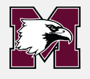
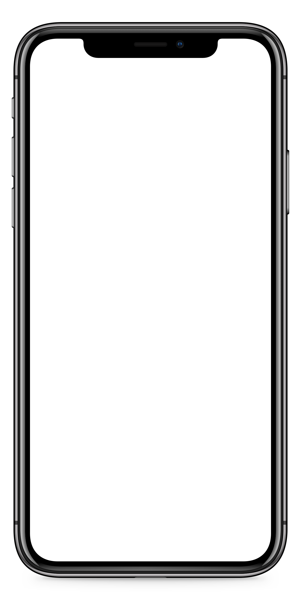
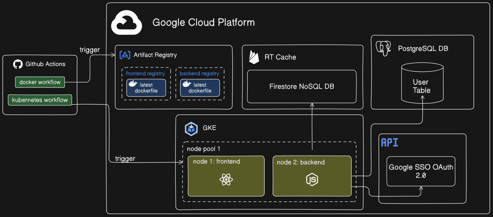
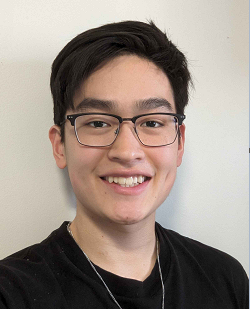

# DBAC-Companion-App

<!-- Improved compatibility of back to top link: See: https://github.com/othneildrew/Best-README-Template/pull/73 -->

<!--
*** Thanks for checking out the Best-README-Template. If you have a suggestion
*** that would make this better, please fork the repo and create a pull request
*** or simply open an issue with the tag "enhancement".
*** Don't forget to give the project a star!
*** Thanks again! Now go create something AMAZING! :D
-->

<!-- PROJECT LOGO -->
 

  

<h3 align="center">DBAC Companion App</h3>

  

    Your mobile application for everything DBAC. Pulse, Sports, Classes, and more.
     
     
    <a href="https://github.com/github_username/repo_name">View Demo</a>
    ·
    <a href="https://github.com/github_username/repo_name/issues/new?labels=bug&template=bug-report---.md">Report Bug</a>
    ·
    <a href="https://github.com/github_username/repo_name/issues/new?labels=enhancement&template=feature-request---.md">Request Feature</a>
  

<!-- TABLE OF CONTENTS -->

  
Table of Contents

  <ol>
    <li>
      <a href="#about-the-project">About The Project</a>
      <ul>
        <li><a href="#built-with">Built With</a></li>
        <li><a href="#DBAC-Companion-App-Architecture">DBAC Companion App Architecture</a></li>
      </ul>
    </li>
    <li>
      <a href="#contributors">Contributors</a>
    </li>
    <li>
      <a href="#project-challenges">Project Challenges</a>
    </li>
  </ol>

<!-- ABOUT THE PROJECT -->
## About The Project

The DBAC Companion App aims to further enhance the experience at one of the most elite athletic centres among all Canadian Universities. By using the DBAC Companion App, attendees of David Braley Athletic Centre will be able enjoy an easier process of working out and breaking goals at the Pulse, finding community with others through the love of sport, and organizing and attending classes lead by skilled trainers.  
<!-- Here's a blank template to get started: To avoid retyping too much info. Do a search and replace with your text editor for the following: `github_username`, `repo_name`, `twitter_handle`, `linkedin_username`, `email_client`, `email`, `project_title`, `project_description` -->

(<a href="#readme-top">back to top</a>)

### Built With

* [![React][React.js]][React-url]
* [![NodeJS][Node.js]][Nodejs-url]
* [![ExpressJS][Express.js]][Expressjs-url]
* [![TailwindCSS][TailwindCSS]][Tailwind-url]
* [![Docker][Docker]][Docker-url]
* [![GKE][GKE]][GKE-url]
* [![PostgreSQL][PostgreSQL]][PostgreSQL-url]

(<a href="#readme-top">back to top</a>)

### DBAC Companion App Architecture

(<a href="#readme-top">back to top</a>)

## Contributors
| 
 Contributor 
                                                    | Most Used Frameworks/Tools                                                                                                                                                                                                                                                                                                   | Notable Contributions                                                                                                                                                                                                                                                                                                                           |
| ----------------------------------------------------------------------------------------------- | ---------------------------------------------------------------------------------------------------------------------------------------------------------------------------------------------------------------------------------------------------------------------------------------------------------------------------- | ----------------------------------------------------------------------------------------------------------------------------------------------------------------------------------------------------------------------------------------------------------------------------------------------------------------------------------------------- |
|    **Ryan Zhang**   <i/> Project Manager & DevOps </i>   |  | <ul><li>Project Design,  Management and Documentation</li><li>[#1: Placeholder ](https://github.com/DSC-McMaster-U/DBAC-Companion-App/)</li><li>[#2: Placeholder](https://github.com/DBAC-Companion-App/)</li></ul> |
    **Aarav Pant**   <i/> Full-stack Developer </i>|  |  <ul><li>[#1: Placeholder ](https://github.com/DSC-McMaster-U/DBAC-Companion-App/)</li><li>[#2: Placeholder](https://github.com/DBAC-Companion-App/)</li></ul> |
    **Abdallah Alqashqish**   <i/> Full-stack Developer </i>|   |  <ul>
 <li>[#8: Frontend Navigation](https://github.com/DSC-McMaster-U/DBAC-Companion-App/pull/8)</li>
 <li>[#13: Removed backend node_modules folder from version control ](=https://github.com/DSC-McMaster-U/DBAC-Companion-App/pull/13)</li>
 <li>[#14: Developed Home Screen UI ](=https://github.com/DSC-McMaster-U/DBAC-Companion-App/pull/14)</li>
 <li>[#17: Equipment Tabular Menu Screen ](=https://github.com/DSC-McMaster-U/DBAC-Companion-App/pull/17)</li>
 <li>[#23: Upgrade expo to V52 ](=https://github.com/DSC-McMaster-U/DBAC-Companion-App/pull/23)</li>
 <li>[#28: Map view components ](=https://github.com/DSC-McMaster-U/DBAC-Companion-App/pull/28)</li>
 <li>[#37: Create User Login + Account Functionality Firebase ](=https://github.com/DSC-McMaster-U/DBAC-Companion-App/pull/37)</li>
 </ul> |
    **Edward Jung**   <i/> Full-stack Developer </i>|   |  <ul><li>[#1: Placeholder ](https://github.com/DSC-McMaster-U/DBAC-Companion-App/)</li><li>[#2: Placeholder](https://github.com/DBAC-Companion-App/)</li></ul> |
    **Eric Park**   <i/> Full-stack Developer </i>|   |  <ul><li>[#1: Placeholder ](https://github.com/DSC-McMaster-U/DBAC-Companion-App/)</li><li>[#2: Placeholder](https://github.com/DBAC-Companion-App/)</li></ul> |
    **Mahdi Mohammad**   <i/> Full-stack Developer </i>|   |  <ul><li>[#1: Placeholder ](https://github.com/DSC-McMaster-U/DBAC-Companion-App/)</li><li>[#2: Placeholder](https://github.com/DBAC-Companion-App/)</li></ul> |
    **Mankaran Rooprai**   <i/> Full-stack Developer </i>|    |  <ul><li>[#9: Added Work-In Functionality to Machine](https://github.com/DSC-McMaster-U/DBAC-Companion-App/pull/9)</li><li>[#2: Placeholder](https://github.com/DBAC-Companion-App/)</li></ul> |
    **Patrick Molka**   <i/> Full-stack Developer </i>|   |  <ul><li>[#1: Placeholder ](https://github.com/DSC-McMaster-U/DBAC-Companion-App/)</li><li>[#2: Placeholder](https://github.com/DBAC-Companion-App/)</li></ul> |
    **Patrick Yeh**   <i/> Full-stack Developer </i>|   |  <ul><li>[#6: Added PoC Postgres CRUD Operations to Backend for User MGMT](https://github.com/DSC-McMaster-U/DBAC-Companion-App/pull/6)</li><li>[#2: Placeholder](https://github.com/DBAC-Companion-App/)</li></ul> |
 
## Project Challenges

Below is a list of challenges that we'll try to address over the course of our project, after developing our MVP. 

<!-- MARKDOWN LINKS & IMAGES -->
<!-- https://www.markdownguide.org/basic-syntax/#reference-style-links -->
[React.js]: https://img.shields.io/badge/React-20232A?style=for-the-badge&logo=react&logoColor=61DAFB
[React-url]: https://reactjs.org/
[Node.js]: https://img.shields.io/badge/Node.js-43853D?style=for-the-badge&logo=node-dot-js&logoColor=white
[Nodejs-url]: https://nodejs.org/en/
[Express.js]: https://img.shields.io/badge/Express.js-404D59?style=for-the-badge
[Expressjs-url]: https://expressjs.com/
[TailwindCSS]: https://img.shields.io/badge/Tailwind_CSS-38B2AC?style=for-the-badge&logo=tailwind-css&logoColor=white
[Tailwind-url]: https://tailwindcss.com/
[Docker]: https://img.shields.io/badge/Docker-2496ED?style=for-the-badge&logo=docker&logoColor=white
[Docker-url]: https://www.docker.com/
[GKE]: https://img.shields.io/badge/GKE-4285F4?style=for-the-badge&logo=google-cloud&logoColor=white
[GKE-url]: https://cloud.google.com/kubernetes-engine
[PostgreSQL]: https://img.shields.io/badge/PostgreSQL-336791?style=for-the-badge&logo=postgresql&logoColor=white
[PostgreSQL-url]: https://www.postgresql.org/
[dbac-screenshot]: /images/screenshot-mobile.png
